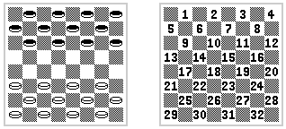

# Tests en Jasmine (amb NPM)

En primer lloc inicialitzem el projecte NPM

    $ npm init -y

En package.json cal dir que utilitze mòduls ESM:
    
    "type": "module"

Ara cal instal·lar Jasmine i el llançador d'una web de tests amb Jasmine:

    $ npm install jasmine-browser-runner jasmine-core
    $ npx jasmine-browser-runner init --esm

Crear `./src`

El fitxer de tests dins de `./spec` es diu `spec.mjs`. Dins es poden importar funcions de mòduls amb `import {...} from "../src/..."` 

    $ npx jasmine-browser-runner serve

## Pràctica Dames

Anem a practicar tests amb les dames. Es proporcionen les funcions de test i cal fer les funcions que són testades. 

Per a fer els tests, partim d’un tauler representat en una matriu:
https://www.jugonestop.com/pregunta/133019/como-nombrar-las-jugadas-de-las-damas 

    const tauler = [
      [0, 2, 0, 2, 0, 2, 0, 2],
      [2, 0, 2, 0, 2, 0, 2, 0],
      [0, 2, 0, 2, 0, 2, 0, 2],
      [0, 0, 0, 0, 0, 0, 0, 0],
      [0, 0, 0, 0, 0, 0, 0, 0],
      [1, 0, 1, 0, 1, 0, 1, 0],
      [0, 1, 0, 1, 0, 1, 0, 1],
      [1, 0, 1, 0, 1, 0, 1, 0]
    ];

En el codi proporcionat es poden veure varies tècniques més avançades ja implementades i amb els seus tests. Es pot aprofitar tot el que està fet o ampliar-ho. Hi ha implementada una especie de mini biblioteca de utilitats que hem anomenat `Ç` imitant a la famosa biblioteca JQuery que utilitza el `$` o Lodash que utilitza `_` . També hem encapsultat algunes utilitats de manipulació del DOM dins de `DOMTools`. Totes tenen ja tests fets. 

A continuació anem a implementar funcions que són dirèctament testables:

* La primera és una funció que implementa un moviment. Aquesta accepta un tauler i un moviment i retorna el tauler amb el moviment fet. 
* Per a que funcione, necessitem abans unes funcions que també hem de fer tests:
    * Una per provar si un moviment és legal
    * Una per provar si un moviment cau damunt d'un dama.
    * Una per provar si un moviment passa per damunt d'una dama contraria i, per tant, se la menja. 
    * Una per llevar la dama menjada. 

De la funció del moviment ja tenim una implementació inicial que pot ser modificada si es vol i un test. 

## Exercici 1 (test de funcions):

Fer els tests de les funcions mencionades abans. 
> Un moviment és legal si en el destí no hi ha cap fitxa. Si es mou cal endavant i sols una casella en diagonal. També és legal si és per menjar una fitxa i es mou dos posicions cap endavant o cap a enrere. 

Aplicar aquestes funcions en una que junte totes: les comprovacions, els moviments i els mejars de fitxes.

Totes les funcions seran pures i es testarà la seua puresa.

## Exercici 2 (Estat del joc):

Cal fer una gestió de l'estat. L'estat és el tauler i el torn actual. Això ho mantindrem centralitzat i privat i sols podrà ser modificat amb funcions. Encara que no tindrem la reactivitat i altres garanties de `Redux`, anem a començar a tractar l'estat separat dels altres components i garantir que és immutable.
TODO
Es proporcionen els tests per a l'estat i els nom de les funcions. Farem les funcions per a que passen els tests.  

## Exercici 3 (Interactivitat):

Quan un usuari del torn que pot moure toca una peça del seu color esta quedarà marcada i pot tocar el destí de la peça, si és legal es mourà i executarà el que siga necessari. Després de menjar-se una fitxa, pot moure de nou la mateixa per menjar una altra fins que no puga o acabe el torn manualment.
Planifica les funcions que proporcionaran aquesta interactivitat, la manera en la que manipularan l'estat i cóm afegir els esdeveniments a les peces. Es faran els tests i les funcions de tot.