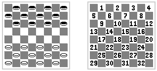

# Jasmine

    $ npm init -y

En package.json:
    
    "type": "module"

    $ npm install jasmine-browser-runner jasmine-core
    $ npx jasmine-browser-runner init --esm

Crear `./src`

El fitxer de tests dins de `./spec` es diu `spec.mjs`. Dins es poden importar funcions de mòduls amb `import {...} from "../src/..."` 

    $ npx jasmine-browser-runner serve

## Pràctica Dames

Anem a practicar tests amb les dames. Es proporcionen les funcions de test i cal fer les funcions que són testades. 

Per a fer els tests, partim d’un tauler representat en una matriu:
https://www.jugonestop.com/pregunta/133019/como-nombrar-las-jugadas-de-las-damas 

    const tauler = [
      [0, 2, 0, 2, 0, 2, 0, 2],
      [2, 0, 2, 0, 2, 0, 2, 0],
      [0, 2, 0, 2, 0, 2, 0, 2],
      [0, 0, 0, 0, 0, 0, 0, 0],
      [0, 0, 0, 0, 0, 0, 0, 0],
      [1, 0, 1, 0, 1, 0, 1, 0],
      [0, 1, 0, 1, 0, 1, 0, 1],
      [1, 0, 1, 0, 1, 0, 1, 0]
    ];

A continuació anem a implementar funcions que són dirèctament testables:

* La primera és una funció que implementa un moviment. Aquesta accepta un tauler i un moviment i retorna el tauler amb el moviment fet. 
* Per a que funcione, necessitem abans unes funcions que també hem de fer tests:
    * Una per provar si un moviment és legal
    * Una per provar si un moviment cau damunt d'un dama.
    * Una per provar si un moviment passa per damunt d'una dama contraria i, per tant, se la menja. 
    * Una per llevar la dama menjada. 

